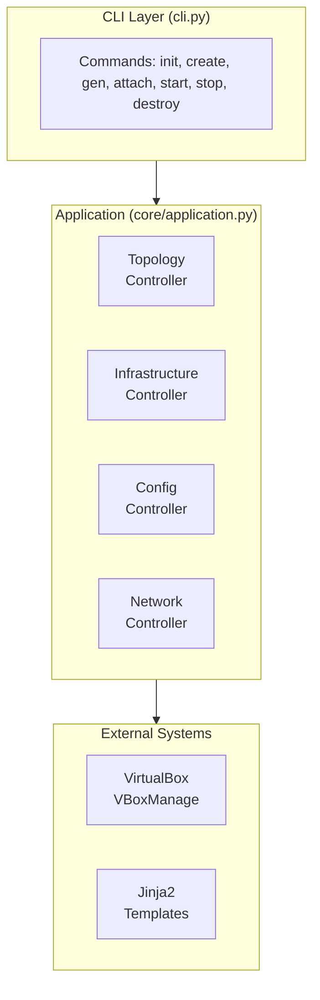

# Architecture

This document describes NetLoom's internal architecture and design.

## Overview

NetLoom follows a **controller-based architecture** with a singleton Application class coordinating multiple specialized controllers. Each controller handles a specific domain of functionality.



## Core Components

### Application

The `Application` class (`netloom/core/application.py`) is the central singleton that:

- Manages controller instances (lazy initialization)
- Provides a shared `Console` for Rich terminal output
- Tracks workdir and debug state

```python
app = Application.current()
app.topology.load("lab.yaml")
app.infrastructure.create(internal)
```

Controllers are accessed as properties and created on first access.

### Controllers

#### TopologyController

**Location:** `netloom/controllers/topology.py`

Handles topology loading and conversion:

| Method                       | Description                                          |
| ---------------------------- | ---------------------------------------------------- |
| `load(path)`                 | Load and validate a YAML topology file               |
| `convert(topology, workdir)` | Convert external topology to internal representation |

The internal representation adds computed fields like interface names, peer relationships, and merged sysctl settings.

#### InfrastructureController

**Location:** `netloom/controllers/infrastructure.py`

Manages VirtualBox VM lifecycle:

| Method                            | Description                                          |
| --------------------------------- | ---------------------------------------------------- |
| `configure(...)`                  | Set VirtualBox settings (basefolder, OVA path, etc.) |
| `init(internal, workdir)`         | Import OVA and create golden snapshot                |
| `create(internal)`                | Create linked clones with config-drives              |
| `start(internal)`                 | Start all VMs                                        |
| `stop(internal)`                  | Stop all VMs (ACPI shutdown)                         |
| `destroy(internal, destroy_base)` | Remove VMs (hard shutdown)                           |
| `get_configdrive(node_name)`      | Get config-drive path for a node                     |

Internally uses `VBoxManage` commands for VM operations.

#### ConfigController

**Location:** `netloom/controllers/config.py`

Handles configuration generation and deployment:

| Method                             | Description                      |
| ---------------------------------- | -------------------------------- |
| `list_template_sets()`             | List available template sets     |
| `generate(internal, template_set)` | Generate configs using templates |
| `attach(internal)`                 | Copy configs to VM config-drives |
| `save(internal)`                   | Pull configs from VMs to host    |
| `restore(internal)`                | Restore saved configs to staging |

#### NetworkController

**Location:** `netloom/controllers/network.py`

Network-related utilities and calculations.

## Data Flow

### 1. Topology Loading

```
YAML File → TopologyController.load() → ExternalTopology (Pydantic Model)
                                             │
                                             ▼
                    TopologyController.convert() → InternalTopology
```

The external `Topology` model mirrors the YAML schema. The internal representation adds:

- Computed interface names (eth1, eth2, ...)
- Peer node relationships
- Merged sysctl settings (defaults + node-specific)
- Resolved service configurations

### 2. Configuration Generation

```
InternalTopology → ConfigController.generate()
                          │
                          ├─→ Jinja2 Environment
                          │       │
                          │       ▼
                          │   Template Sets (networkd/, services/)
                          │       │
                          │       ▼
                          └─→ Generated Files (workdir/configs/<node>/)
```

### 3. VM Deployment

```
InternalTopology → InfrastructureController.create()
                          │
                          ├─→ VBoxManage clonevm (linked clone)
                          ├─→ VBoxManage createmedium (config-drive)
                          └─→ VBoxManage modifyvm (NICs, hardware)
```

## Models

### External Models (`netloom/models/config.py`)

Pydantic models that match the YAML schema:

- `Topology` - Root model
- `Meta` - Topology metadata
- `Defaults` - Global defaults
- `Link` - Node connections
- `Node` - Node configuration
- `InterfaceConfig`, `BridgeConfig`, `RoutingConfig`, etc.

### Internal Models (`netloom/models/internal.py`)

Runtime representations with computed fields:

- `InternalTopology` - Enriched topology
- `InternalNode` - Node with resolved interfaces
- `InternalInterface` - Interface with peer info
- `InternalLink` - Link with interface references

## Template System

Templates are organized in `netloom/templates/`:

```
templates/
├── _base/
│   └── _macros.j2       # Shared Jinja2 macros
├── networkd/            # systemd-networkd templates
│   ├── hostname.j2
│   ├── interface.network.j2
│   ├── routes.network.j2
│   └── sysctl.conf.j2
└── services/
    └── services.list.j2
```

### Template Context

Each template receives:

- `node` - The internal node model
- `topology` - The full internal topology
- Global macros from `_base/_macros.j2`

### Output Mapping

Template filenames determine output paths:

| Template               | Output                                |
| ---------------------- | ------------------------------------- |
| `hostname.j2`          | `etc/hostname`                        |
| `interface.network.j2` | `etc/systemd/network/<iface>.network` |
| `sysctl.conf.j2`       | `etc/sysctl.d/99-netloom.conf`        |

## VirtualBox Integration

NetLoom uses `VBoxManage` CLI for all VM operations:

### Linked Clones

VMs are created as linked clones from a golden snapshot:

```bash
VBoxManage clonevm "Labs-Base" --name "R1" --snapshot "golden" \
    --options link --register
```

Benefits:

- Fast creation (no full disk copy)
- Minimal disk usage
- Shared base image

### Config-Drives

Each VM has a FAT-formatted VMDK attached as a secondary disk:

```bash
VBoxManage createmedium disk --filename "R1-cfg.vmdk" \
    --size 16 --format VMDK
```

The config-drive contains network configurations that the VM applies on boot.

### Internal Networks

Links are implemented as VirtualBox internal networks:

```bash
VBoxManage modifyvm "R1" --nic2 intnet --intnet2 "lab-R1-R2"
```

Each link gets a unique internal network name ensuring isolation.

## Extension Points

### Custom Template Sets

Create a new directory in `templates/` with your templates:

```
templates/
└── my-templates/
    ├── custom.conf.j2
    └── ...
```

Use with: `netloom --topology lab.yaml gen --templates my-templates`

### Adding Controllers

1. Create a new controller class inheriting from `BaseController`
2. Add a property in `Application` class
3. Wire up CLI commands in `cli.py`
