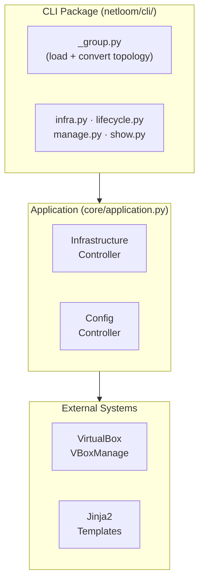

# Architecture

This document describes NetLoom's internal architecture and design.

## Overview

NetLoom follows a **controller-based architecture** with a singleton Application class coordinating multiple specialized controllers. Each controller handles a specific domain of functionality.


```mermaid
flowchart TB
    subgraph CLI["CLI Package (netloom/cli/)"]
        group["_group.py\n(load + convert topology)"]
        cmds["infra.py · lifecycle.py\nmanage.py · show.py"]
    end

    subgraph App["Application (core/application.py)"]
        direction LR
        IC[Infrastructure\nController]
        CC[Config\nController]
    end

    subgraph External["External Systems"]
        direction LR
        VBox[VirtualBox\nVBoxManage]
        Jinja[Jinja2\nTemplates]
    end

    CLI --> App
    App --> External
```

## Core Components

### Application

The `Application` class (`netloom/core/application.py`) is the central singleton that:

- Manages controller instances (lazy initialization)
- Provides a shared `Console` for Rich terminal output
- Tracks `workdir`, `debug` state, and `vbox_settings`

```python
app = Application.current()
app.infrastructure.create(internal)
app.config.generate(internal)
```

Controllers are accessed as properties and created on first access. They must never import each other at module level - siblings are accessed via `self.app.other_controller` inside methods.

### Controllers

#### InfrastructureController

**Location:** `netloom/controllers/infrastructure.py`

Manages VirtualBox VM lifecycle via `VBoxManage`:

| Method                            | Description                                  |
| --------------------------------- | -------------------------------------------- |
| `init(internal, workdir)`         | Import OVA and create golden snapshot        |
| `create(internal)`                | Create linked clones with config-drives      |
| `start(internal)`                 | Start all VMs                                |
| `stop(internal)`                  | Stop all VMs (ACPI shutdown)                 |
| `destroy(internal, destroy_base)` | Remove VMs (hard shutdown + unregister)      |

#### ConfigController

**Location:** `netloom/controllers/config.py`

Handles configuration generation and deployment:

| Method                   | Description                                        |
| ------------------------ | -------------------------------------------------- |
| `list_template_sets()`   | List available template sets                       |
| `generate(internal)`     | Render Jinja2 templates; auto-detects sets per node|
| `attach(internal)`       | Copy configs to VM config-drives                   |
| `save(internal)`         | Pull configs from config-drives to host            |
| `restore(internal)`      | Restore saved configs to staging area              |

`generate()` always renders the `networkd` set and auto-detects additional sets per node:

- `bird` — when `routing.engine` is `bird`
- `nftables` — when `services.firewall` is configured
- `wireguard` — when `services.wireguard` is configured

## Data Flow

### 1. Topology Loading

```text
YAML File → load_topology() → Topology (Pydantic, mirrors YAML schema)
                                    │
                                    ▼
              convert_topology() → InternalTopology (runtime representation)
```

Both functions are called in the CLI group (`netloom/cli/_group.py`) before dispatching to any subcommand. The result is stored in `ctx.obj["internal"]`.

The conversion adds:

- Deterministic MAC addresses per interface (seeded from `<topo-id>-<node>-<iface>`)
- VirtualBox NIC index allocation per node
- Peer node relationships
- Merged sysctl settings (defaults + node-specific)
- Resolved service configurations

### 2. Configuration Generation

```text
InternalTopology → ConfigController.generate()
                          │
                          ├─→ networkd/     (always)
                          ├─→ bird/         (if routing.engine == bird)
                          ├─→ nftables/     (if services.firewall set)
                          └─→ wireguard/    (if services.wireguard set)
                                  │
                                  ▼
                     workdir/configs/<node>/etc/...
```

### 3. VM Deployment

```text
InternalTopology → InfrastructureController.create()
                          │
                          ├─→ VBoxManage clonevm   (linked clone per node)
                          ├─→ VBoxManage createmedium  (config-drive VMDK)
                          └─→ VBoxManage modifyvm   (NICs → internal networks)
```

## Models

### External Models (`netloom/models/config.py`)

Pydantic models that match the YAML schema exactly:

- `Topology` — root model (`meta`, `networks`, `nodes`, `defaults`)
- `Meta` — topology metadata
- `Defaults` — global defaults (`ip_forwarding`, `sysctl`, `vbox`)
- `Network` — named L2 network segment
- `Node` — node configuration
- `InterfaceConfig` — named interface (dict value in `node.interfaces`)
- `VLANConfig`, `TunnelConfig`, `BridgeConfig`
- `StaticRoute` — `{destination, gateway}` object
- `RoutingConfig`, `OSPFConfig`, `RIPConfig`
- `ServicesConfig`, `WireguardConfig`, `FirewallConfig`

### Internal Models (`netloom/models/internal.py`)

Runtime representations with computed and enriched fields:

- `InternalTopology` — full topology with node/link indexes
- `InternalNode` — node with resolved interfaces, computed config dirs
- `InternalInterface` — interface with `mac_address`, `vbox_nic_index`, `peer_node`, `network`
- `InternalNetwork` — L2 segment with VirtualBox network name and participant list
- `InternalLink` — point-to-point connection (subset of networks with exactly 2 participants)
- `InternalBridge`, `InternalVLAN`, `InternalTunnel`
- `InternalRouting`, `InternalServices`, `InternalSysctl`
- `InternalVBoxSettings` — per-node or topology-level VirtualBox settings

## Template System

Templates live in `netloom/templates/` organized by technology:

```bash
templates/
├── _base/
│   └── _macros.j2            # Shared Jinja2 macros
├── networkd/                 # systemd-networkd (always rendered)
│   ├── hostname.j2
│   ├── interface.link.j2     # MAC-based interface rename rule
│   ├── interface.network.j2
│   ├── bridge.netdev.j2
│   ├── bridge.network.j2
│   ├── bridge-port.network.j2
│   ├── vlan.netdev.j2
│   ├── vlan.network.j2
│   ├── vlan-parent.network.j2
│   ├── tunnel.netdev.j2
│   ├── tunnel.network.j2
│   ├── routes.network.j2
│   └── sysctl.conf.j2
├── bird/                     # BIRD routing daemon
│   ├── bird.conf.j2
│   ├── ospf.conf.j2
│   ├── rip.conf.j2
│   └── static.conf.j2
├── nftables/                 # nftables firewall
│   └── nftables.conf.j2
├── wireguard/                # WireGuard VPN
│   └── wg0.conf.j2
└── services/
    └── services.list.j2
```

### Template Context

Each template receives:

- `node` — `InternalNode` for the node being configured
- `topology` — the full `InternalTopology`
- `iface` — `InternalInterface` (for per-interface templates)

### Output Path Mapping

Template filenames determine output paths (resolved by `ConfigController._OUTPUT_PATHS`):

| Template pattern    | Output path                               |
| ------------------- | ----------------------------------------- |
| `hostname.j2`       | `etc/hostname`                            |
| `*.network.j2`      | `etc/systemd/network/<name>.network`      |
| `*.netdev.j2`       | `etc/systemd/network/<name>.netdev`       |
| `*.link.j2`         | `etc/systemd/network/<name>.link`         |
| `sysctl.conf.j2`    | `etc/sysctl.d/99-netloom.conf`            |
| `*.conf.j2`         | `etc/<name>.conf`                         |

## VirtualBox Integration

NetLoom uses `VBoxManage` CLI for all VM operations.

### Linked Clones

VMs are created as linked clones from a golden snapshot:

```bash
VBoxManage clonevm "Labs-Base" --name "R1" --snapshot "golden" \
    --options link --register
```

Benefits:

- Fast creation (no full disk copy)
- Minimal disk usage
- Shared base image

### Config-Drives

Each VM has a FAT-formatted VMDK attached as a secondary disk:

```bash
VBoxManage createmedium disk --filename "R1-cfg.vmdk" \
    --size 16 --format VMDK
```

The config-drive contains network configurations that the VM applies on boot.

## Data Layer (`netloom/data/`)

Config-drive I/O is handled by two modules:

### `configdrive.py` — `ConfigDrive`

`ConfigDrive` is a dataclass wrapping a VirtualBox split VMDK pair:

| File                  | Role                                        |
| --------------------- | ------------------------------------------- |
| `<node>-cfg.vmdk`     | VirtualBox descriptor (metadata only)       |
| `<node>-cfg-flat.vmdk`| Raw data file — the actual FAT16 filesystem |

`_fat.py` operates directly on the flat file; the descriptor is only used by VirtualBox itself.

```python
drive = ConfigDrive(vmdk=Path("R1-cfg.vmdk"))
drive.copy_in(Path("workdir/configs/R1"))   # staging → config-drive
drive.copy_out(Path("workdir/saved/R1"))    # config-drive → host
```

| Method                | Description                                    |
| --------------------- | ---------------------------------------------- |
| `copy_in(src_dir)`    | Write a directory tree into the FAT filesystem |
| `copy_out(dst_dir)`   | Read all files from the FAT filesystem to host |
| `.flat`               | Property returning the `-flat.vmdk` path       |

### `_fat.py` — FAT16 helpers

Internal helpers that operate on the raw flat VMDK using `fattools`:

| Function                             | Description                                         |
| ------------------------------------ | --------------------------------------------------- |
| `open_fat_fs(path, mode)`            | Context manager — opens the flat file as a FAT fs   |
| `format_fat16(path, size_mb)`        | Format a raw file as FAT16                          |
| `makedirs(fs, path)`                 | Create directory hierarchy inside the FAT fs        |
| `copy_dir_recursive(fs, dst, copied)`| Recursively copy FAT fs tree to a local directory   |

### Internal Networks

Networks are implemented as VirtualBox internal networks named `<topology-id>_<network-name>`:

```bash
VBoxManage modifyvm "R1" --nic2 intnet --intnet2 "my-lab_r1-r2"
```

All interfaces on different nodes that share the same `network` name in the YAML are connected to the same VirtualBox internal network, acting as a virtual L2 switch.

## Extension Points

### Custom Template Sets

Create a new directory in `netloom/templates/` with your templates:

```bash
netloom/templates/
└── my-templates/
    ├── custom.conf.j2
    └── ...
```

Then register it in `ConfigController._get_output_path` and add a `_render_template_set` call in `ConfigController.generate`.

### Adding Controllers

1. Create a new class inheriting from `BaseController` (`netloom/core/controller.py`)
2. Add a `@cached_property` in `Application` returning the new controller
3. Add CLI commands in the appropriate module under `netloom/cli/`
